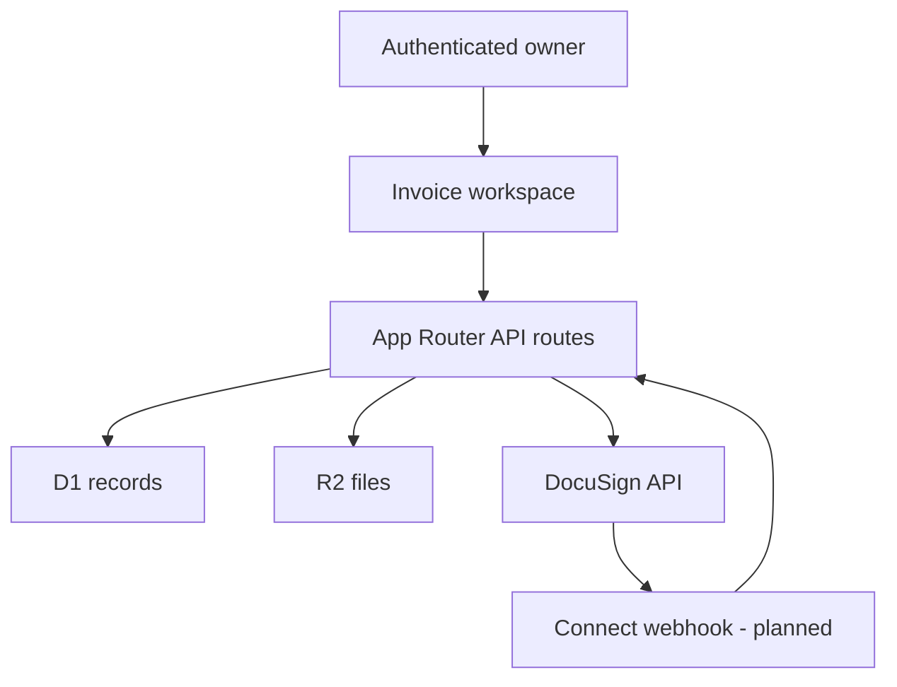

# Architecture

## System overview

The hosted application is a single-company, owner-authenticated workspace. The
React client edits jobs and documents, while server routes enforce ownership
and access D1 or R2 through Cloudflare runtime bindings.

## Application layers

### Interface

`app/invoice-app.tsx` contains the primary job dashboard, invoice editor,
change-order workflow, settings, and customer-document previews. Reusable
controls live in `components/ui`.

### Authentication boundary

Sites injects authenticated-user headers. Server code reads the owner email
from `oai-authenticated-user-email` and uses it as the workspace partition key.
The browser must never be allowed to choose or override that value.

### Structured storage

| Table | Purpose |
| --- | --- |
| `workspace_states` | One serialized MVP workspace per owner |
| `stored_documents` | Metadata and R2 object keys for immutable job files |
| `docusign_connections` | Account metadata and encrypted OAuth tokens |
| `docusign_oauth_states` | Short-lived, one-time callback state values |

The serialized workspace keeps the MVP workflow simple and atomic. A later
multi-user release should normalize customers, jobs, documents, line items,
and audit events before adding concurrent editing.

### Object storage

R2 stores two private object families:

- `branding/{owner}/company-logo`
- `signed/{owner}/{documentId}/{uuid}.pdf`

D1 holds metadata; R2 holds the file bytes. Downloads first verify ownership in
D1 and then retrieve the referenced object.

### DocuSign boundary

The TypeScript routes own the hosted OAuth flow. OAuth tokens are encrypted
with AES-GCM before being written to D1. The Python gateway is an optional
reference adapter and is not the hosted application's source of OAuth tokens.

## Main flows

### Save workspace

1. The UI serializes settings, jobs, invoices, and change orders.
2. `PUT /api/workspace` resolves the authenticated owner.
3. The route validates the payload and enforces a 2 MB limit.
4. D1 inserts or updates that owner's snapshot.

### Upload signed PDF

1. The UI sends a PDF and internal document ID.
2. The route validates authentication, MIME type, and the 10 MB limit.
3. R2 stores the PDF under an owner-scoped random object key.
4. D1 records the job-document lookup metadata.

### Connect DocuSign

1. The owner starts OAuth from Settings.
2. The server creates a one-time state row with a ten-minute expiry.
3. DocuSign redirects to the registered callback.
4. The callback exchanges the code, loads the default DocuSign account, and
   encrypts both tokens.
5. D1 upserts one connection for the owner and deletes the used state.

## Important constraints

- The application currently supports one workspace per authenticated owner.
- Change orders are preserved as separate job documents; they do not mutate a
  previously issued invoice.
- The hosted runtime, not source code, supplies D1, R2, and secrets.
- Completed DocuSign envelope reconciliation is not implemented yet.
