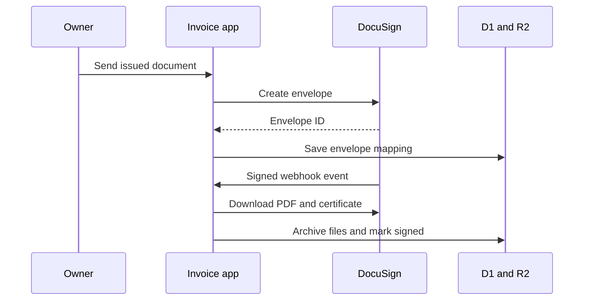

# DocuSign integration

## Current status

Implemented:

- Authorization Code OAuth start route
- One-time, expiring OAuth state in D1
- OAuth callback and code exchange
- Default-account discovery through DocuSign user info
- AES-GCM encryption before token storage
- Owner-scoped connection status
- Demo/production account-domain selection

Not yet implemented:

- Refresh-token rotation helper
- Envelope creation from an issued invoice or change order
- Signer tabs and signature anchors in the final document
- Authenticated Connect webhook endpoint
- Idempotent envelope-event processing
- Completed PDF and certificate download
- Automatic R2 archive and job-history update
- Failure, decline, void, and resend workflows

The UI must continue to describe DocuSign as setup-ready, not live, until the
full completion path is verified.

## Configure a DocuSign Demo app

1. Create or open a DocuSign developer account.
2. Create an app and Integration Key under Apps & Keys.
3. Add this exact redirect URI:

   ```text
   https://joshuas-remodeling.joshuareyes09876.chatgpt.site/api/docusign/callback
   ```

4. Create a client secret.
5. Generate a separate long random token-encryption secret.
6. Add all values as protected Sites environment variables.
7. Set `DOCUSIGN_ENVIRONMENT=demo`.
8. Open Settings in the application and select **Connect DocuSign**.

Do not paste secrets into GitHub issues, pull requests, screenshots, chat
messages, or documentation.

## Required hosted variables

```text
DOCUSIGN_CLIENT_ID=<integration key>
DOCUSIGN_CLIENT_SECRET=<client secret>
DOCUSIGN_TOKEN_ENCRYPTION_KEY=<long random application secret>
DOCUSIGN_REDIRECT_URI=https://joshuas-remodeling.joshuareyes09876.chatgpt.site/api/docusign/callback
DOCUSIGN_ENVIRONMENT=demo
```

## Completion design



### Envelope creation

The send route should:

1. Resolve the authenticated owner and load the issued document.
2. Load and decrypt that owner's DocuSign connection.
3. Refresh an expired access token and persist rotated tokens atomically.
4. Render a stable PDF or HTML document with explicit signing anchors.
5. Create the envelope with one signer and an internal document identifier.
6. Save `envelope_id`, `document_id`, status, and timestamps in D1.
7. Return a safe status object without exposing tokens.

### Connect webhook

The webhook should:

1. Validate DocuSign's configured authentication or HMAC signature before
   parsing business events.
2. Deduplicate events by a stable event identifier.
3. Resolve the envelope-to-job mapping from D1 rather than trusting arbitrary
   job information in the payload.
4. Record sent, delivered, completed, declined, and voided transitions.
5. On completion, download the combined signed PDF and certificate.
6. Store both files under owner- and document-scoped R2 keys.
7. Update the job timeline in one idempotent operation.
8. Return success quickly and move slower retrieval work to background
   execution when the platform allows it.

### Suggested schema additions

- `docusign_envelopes`
  - owner email
  - internal document ID
  - envelope ID, unique
  - document type (`invoice` or `change_order`)
  - status
  - signer name and email
  - sent, completed, and updated timestamps
- `docusign_events`
  - stable event ID, unique
  - envelope ID
  - event type
  - received and processed timestamps
  - processing result

## Demo acceptance test

The integration is ready for production review only when this path passes:

1. Connect a Demo account.
2. Send an invoice to a test signer.
3. Confirm the job shows the envelope as sent.
4. Sign the document through the recipient link.
5. Confirm an authenticated webhook marks it completed exactly once.
6. Download the archived signed PDF from the correct job.
7. Download or otherwise retain the completion certificate.
8. Repeat with a change order and confirm the original invoice is unchanged.
9. Exercise decline, void, expired-token refresh, and webhook retry cases.

Only then should the app move from Demo credentials to production credentials.
